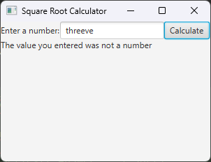
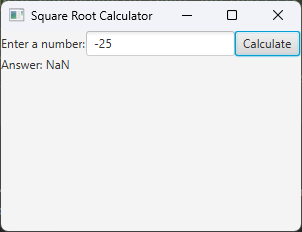

* TOC
{:toc}

# Simple JavaFX App - Square Root

In this module, we will build a simple GUI application that calculates the square root of a number using the JavaFX Framework.

## Code

The code below shows a simple app for getting the square root of a number. I will discuss some implementation and design decisions below.

```java

import javafx.application.Application;
import javafx.event.ActionEvent;
import javafx.event.EventHandler;
import javafx.scene.Scene;
import javafx.scene.control.Button;
import javafx.scene.control.Label;
import javafx.scene.control.TextField;
import javafx.scene.layout.FlowPane;
import javafx.scene.layout.Pane;
import javafx.stage.Stage;

public class SqrtCalculator extends Application {
    Label instructions;
    TextField input;
    Label resultDisplay;
    Button calculateButton;

    @Override
    public void start(Stage stage) {
        createUIObjects();
        Pane root = createRootPane();
        createAndShowScene(stage, root);
    }

    private void createUIObjects() {
        instructions = new Label("Enter a number:");

        input = new TextField();

        resultDisplay = new Label("");
        resultDisplay.setVisible(false);

        createCalculateButton();
    }

    private FlowPane createRootPane() {
        FlowPane root = new FlowPane();
        root.getChildren().addAll(instructions, input, calculateButton, resultDisplay);
        return root;
    }

    private void createAndShowScene(Stage stage, Pane root) {
        stage.setTitle("Square Root Calculator");
        Scene scene = new Scene(root, 300, 200);
        stage.setScene(scene);
        stage.show();
    }

    private void createCalculateButton() {
        calculateButton = new Button();
        calculateButton.setText("Calculate");
        calculateButton.setOnAction(e -> handleCalculateButton());
    }
    
    private void handleCalculateButton() {
        resultDisplay.setVisible(true);
        try {
            double x = Double.parseDouble(input.getText());
            double sqrt = Math.sqrt(x);
            resultDisplay.setText("Answer: " + sqrt);
        } catch (NumberFormatException e) {
            resultDisplay.setText("The value you entered was not a number");
        }

    }
}

```

## Fields

You'll note that I have a field for each widget I use -- two Labels, one TextField, and one Button. This practice will become common especially once we introducing formatting our applications using FXML files. The idea is that the state of each of these widgets describes the state of our user interface.

## Function Decomposition

I could include all of this content in a single function. However, I broke it up because it helps me interpret the code, especially if I need to do some debugging or make changes. 

For example, let's say I wanted to update and, instead of using a FlowPane, use something like a VBox with some additional formatting. In this case, I could localize all of my changes to the `createRootPane()` function. Additionally, you'll notice that outside of this function, I only use the abstract class `Pane`, instead of `FlowPane`. This shows an advantage of using the most abstract meaningful type, as now the rest of my code doesn't care what kind of Pane I'm using. It could be a FlowPane, VBox, HBox, BorderPane, GridPane, etc., and I wouldn't have to change a line of code outside of this function. Further, this separates "setting up the layout" completely from creating the widgets, setting up the button, or handle the button ActionEvents. 

In `createCalculateButton()`, I could replace the lambda body for `calculateButton.setOnAction(e -> handleCalculateButton());` with a code body that is the same as my `handleCalculateButton` function, however I separated them because these two functions do different things. The first function, `createCalculateButton()`, is responsible for *creating the button*. The second function, `handleCalculateButton()` describes the event handling of the button. However, because these functions are tightly related, I wanted to ensure that they were adjacent to each other in code to improve readability. Never underestimate how much simply changing the order of functions can improve code readability.

## The Button Handler

Whenever you are creating a user interface, you always want to have reasonable error-tolerance. That is, a user error should never crash the interface. The best way to handle user errors is to inform the users:

* Why the error occurred
* How to fix that error

Let's look at the code for `handleCalculateButton()` below:

```java
    private void handleCalculateButton() {
        resultDisplay.setVisible(true);
        try {
            double x = Double.parseDouble(input.getText());
            double sqrt = Math.sqrt(x);
            resultDisplay.setText("Answer: " + sqrt);
        } catch (NumberFormatException e) {
            resultDisplay.setText("The value you entered was not a number");
        }

    }
```

In this case, the user error I am handling is when a user enters something that isn't a number. For example:



Because `Double.parseDouble` throws a `NumberFormatException` if the value text cannot be parsed to a double, I handle that by setting the text of our `resultDisplay` label to indicate that the value entered wasn't a number. This tells the user why the error occurred, and they can easily intuit how to fix it (next time, try entering a number!).

One error you notice I don't handle is the square root of a negative. Here, it's worth knowing that `Math.sqrt` does not throw an exception when the input is negative. Rather, it returns `Double.NaN`, where `NaN` stands for **N**ot **a** **N**umber. However, despite not throwing an exception, this may be something we want to change. This is because if we look at the output with a negative entry:



...you'll see that the given display message isn't helpful unless you already know what `NaN` means. As such, we can update our button handler method:

```java
    private void handleCalculateButton() {
        resultDisplay.setVisible(true);
        try {
            double x = Double.parseDouble(input.getText());
            if (x < 0.0) {
                resultDisplay.setText("Error: cannot calculate square root of negative number");
            } else {
                double sqrt = Math.sqrt(x);
                resultDisplay.setText("Answer: " + sqrt);
            }
        } catch (NumberFormatException e) {
            resultDisplay.setText("The value you entered was not a number");
        }
    }
```

And this will improve our error message quality. These changes are focused on **Usability**, that is, making the software easier to understand and use. We have a unit that highlights some keys to consider in this course, but Usability is a very deep topic, and there are entire courses that focus on Usability in software. However, an idea to keep in mind is that you should never assume the user will "figure out" what they did wrong unless you tell them.

